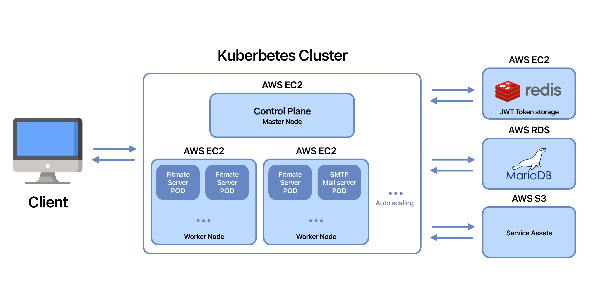

# FitnessMateBackEnd

## Contributors

| 이름  | Github                       | 기술블로그 및 페이지                    |
|-----|------------------------------|--------------------------------|
| 이찬하 | https://github.com/chanhalee | https://sincerity.page/        |
| 정지성 | https://github.com/zzzzseong | https://zzzzseong.tistory.com/ |

  

## Fitnessmate Backend Infra Architecture

  

## Code Refactoring Timeline
- `2024.03.02` `Jisung Jung` Directory architecture DDD로 변경 시작

